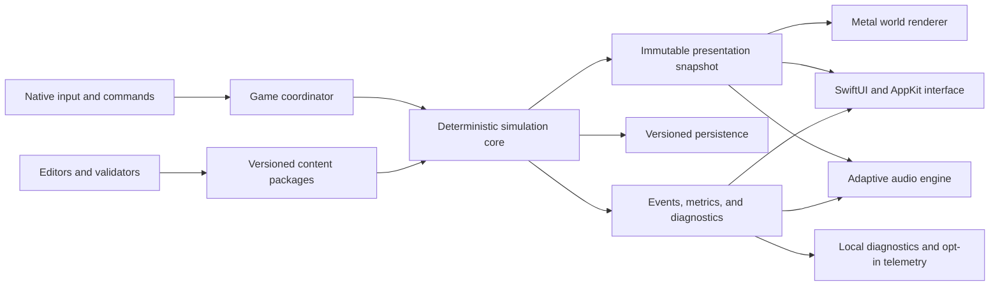

# Technical Architecture Specification

## 1. Architecture objective

The release architecture must sustain a large, persistent, deterministic city while rendering a richly animated 3D world and a responsive native interface. It must make state ownership obvious, support parallel work without hidden mutation, and retain enough observability to explain simulation outcomes and player-reported failures.

The current SwiftUI and SpriteKit application is the playable vertical slice. It proves the native shell, interaction pattern, save loop, and first-order simulation. SpriteKit procedural geometry is not the final AAA renderer. The engine and renderer decision must be approved at the first preproduction gate; the default recommendation is a native Swift and C++ simulation core, SwiftUI and narrow AppKit shell, and Metal-based renderer.

## 2. Platform baseline

The product is a native, universal macOS application optimized for Apple silicon. The provisional development baseline is macOS 14 or later and Swift 6 language mode. Final minimum OS, Intel support, storefronts, hardware tiers, and engine choice are open release decisions.

Core simulation, saves, input, UI, rendering, and audio must not depend on an embedded browser or always-available network service.

## 3. System topology

The runtime is divided into these packages or equivalent modules:

- **App shell:** lifecycle, windows, menus, display, platform services, settings, and accessibility.
- **Game coordinator:** session state, command routing, pause and speed, mode transitions, and safe shutdown.
- **Simulation core:** authoritative clock, entity registry, systems, deterministic jobs, events, and command results.
- **World model:** terrain, parcels, spatial indexes, networks, districts, environment, and external connections.
- **Gameplay systems:** construction, population, economy, finance, mobility, utilities, services, governance, progression, and incidents.
- **Presentation snapshot:** immutable, compact state consumed by UI, renderer, and audio.
- **Renderer:** world streaming, visibility, materials, lighting, animation, effects, overlays, picking, and photo mode.
- **Native UI:** HUD, tools, inspectors, management workspaces, charts, onboarding, and accessibility.
- **Audio:** music state, ambience graph, point emitters, UI feedback, voice, and mix preferences.
- **Persistence:** snapshots, journals, migrations, thumbnails, integrity, autosaves, and recovery.
- **Content and tools:** schemas, import, validation, balancing, scenario authoring, asset processing, and localization.
- **Diagnostics:** logs, metrics, traces, crash context, benchmark harness, support package, and replay fixtures.

## 4. Authority and mutation

The simulation core is the only authority for gameplay state. UI, renderer, audio, analytics, and tools consume snapshots or explicit queries. They never mutate simulation entities directly.

Player and scenario actions are typed commands containing stable command ID, target tick, actor, payload, source, and schema version. The simulation returns accepted, rejected, scheduled, partially applied, or canceled with a reason code and affected entity IDs.

Systems do not write into another system's private state. Cross-system effects use declared shared components, staged deltas, or events applied at deterministic barriers.

## 5. Simulation model

### 5.1 Clock and determinism

The simulation advances through a fixed logical tick and named lower-frequency schedules. Given the same build compatibility version, content set, initial save, seed set, ordered commands, and tick count, authoritative outputs must match the determinism contract.

Determinism requires:

- Stable entity and component iteration order.
- Explicit random streams by subsystem and purpose.
- No wall-clock, locale, thread-scheduling, address, or renderer dependence.
- Defined numeric precision, rounding, overflow, and reduction rules.
- Deterministic path tie-breaking and job merge order.
- State hashing at diagnostic checkpoints.

Cross-platform bit identity is required only for supported release architectures declared by the determinism ADR. If floating-point behavior prevents that target, the ADR must specify tolerance and authoritative serialization behavior before production.

### 5.2 Entity and data layout

Persistent entities use stable 64-bit or wider IDs with generation protection. Frequently updated simulation data uses cache-conscious component storage or another measured data-oriented design. Rich design definitions remain immutable content records referenced by stable content IDs.

Households, people, businesses, buildings, vehicles, trips, projects, networks, districts, facilities, incidents, objectives, and ledger entries have explicit lifecycle states. Deletion is staged so dependent systems can resolve references and history safely.

### 5.3 Scale strategy

The simulation uses multiple fidelity tiers:

- Persistent statistical or cohort state for the full population.
- Persistent household, business, building, and network state where it drives decisions.
- Scheduled trip and service state for active demand.
- High-fidelity movement only in relevant visible or congested regions.
- Aggregated background advancement with conservation checks elsewhere.

Fidelity transitions cannot create or destroy money, people, goods, trips, utility flow, or objective progress outside documented rounding bounds.

The provisional release workload is a 250,000-resident-equivalent mature city, 100,000 buildings or network entities, 100,000 concurrent scheduled trips, and 20,000 visible moving agents. Final scale requires benchmark approval.

## 6. Concurrency and scheduling

The runtime separates:

- Main thread for AppKit and SwiftUI obligations.
- Render thread and GPU submission according to the selected Metal architecture.
- Dedicated simulation coordinator.
- Deterministic worker pool for partitionable simulation jobs.
- Asynchronous I/O and content streaming.
- Background compression, thumbnail, analytics, and support-export work.

Simulation jobs declare read and write sets. The scheduler builds deterministic phases and merges outputs in stable order. Rendering may skip presentation updates under load; the simulation may not silently skip authoritative ticks. If catch-up exceeds its budget, speed visibly throttles and diagnostics record the cause.

## 7. Presentation snapshots

At a bounded cadence, the simulation publishes immutable snapshots or diffs containing only presentation-required state. Snapshot generation has a measured budget and supports:

- Stable entity identity and lifecycle events.
- Current and previous transforms for interpolation.
- Visual state, animation intent, LOD metadata, and effect events.
- UI summaries, inspector details, overlays, objective state, and notifications.
- Audio emitter and music-state inputs.
- Freshness and authoritative tick metadata.

The renderer and UI can interpolate or animate between snapshots, but inspectable numeric values identify their authoritative tick.

## 8. Renderer

The target renderer must support:

- Metal-native deferred, forward-plus, or measured hybrid rendering.
- GPU-driven visibility and indirect drawing where appropriate.
- Instancing, mesh and material batching, LOD, impostors, occlusion, and world streaming.
- Physically based materials, region lighting, cascaded or equivalent shadows, water, weather, night emissives, and scalable reflections.
- Terrain, network spline or mesh generation, modular buildings, crowd and vehicle animation, particles, decals, and damage states.
- Selection and picking, construction previews, analytic overlays, photo mode, and accessibility variants.
- Shader and pipeline prewarming to avoid interaction hitching.

Renderer state is disposable presentation state. A GPU reset, display change, or graphics-quality change may rebuild it without changing the simulation.

## 9. Performance budgets

Budgets are measured on golden cities and approved hardware tiers. Provisional targets are:

| Area | Target tier | Baseline tier |
| --- | ---: | ---: |
| Display workload | 2560 by 1440 | 1920 by 1080 |
| Frame rate | 60 fps at normal play | 30 fps minimum at normal play |
| GPU frame | 14 ms at 95th percentile | 30 ms at 95th percentile |
| Main-thread work | 5 ms at 95th percentile | 10 ms at 95th percentile |
| Simulation tick | 8 ms average budget | 16 ms average budget |
| Input-to-visible response | Under 100 ms at 95th percentile | Under 150 ms at 95th percentile |
| Resident memory | 6 GB target, 8 GB hard gate | 4 GB target, 6 GB hard gate |
| New-game start | Under 15 seconds | Under 25 seconds |
| Mature-city load | Under 10 seconds target | Under 20 seconds hard gate |
| Background save snapshot | Under 100 ms main-thread interruption | Under 200 ms hard gate |
| Complete mature-city save | Under 5 seconds target | Under 10 seconds hard gate |

Normal play includes an active mature city, standard UI, normal weather, representative traffic, and default graphics. Empty-map results cannot satisfy a release gate. Photo mode and deliberately uncapped creative settings may declare separate budgets.

Frame, simulation, memory, I/O, content-streaming, shader-compilation, and save budgets are continuously recorded in benchmark runs. A regression above five percent requires triage; a budget breach blocks the owning gate.

## 10. Persistence and replay

A save package contains manifest, schema and compatibility versions, content dependency list, authoritative state, random stream state, command or event tail needed for recovery, metadata, integrity hashes, and screenshot. Saves never serialize renderer objects or platform pointers.

Save writes use snapshot isolation, temporary output, validation, durable flush where available, and atomic replacement. Autosave rotation preserves at least three known-good generations. Manual saves are never silently overwritten by autosave.

Every schema change declares backward read behavior, migration, validation, failure message, fixture, and rollback policy. Release builds preserve support for all saves created by the same major release and the compatibility window approved for later releases.

Deterministic replay fixtures store initial state, seeds, commands, expected checkpoints, and compatibility version. They support simulation tests, desync diagnosis, balance comparisons, and support reproduction.

## 11. Content and tools architecture

Content definitions use human-reviewable source data compiled into versioned runtime packages. Schemas distinguish stable content ID from localized name and asset path. The build validates dependencies, cycles, units, bounds, localization, assets, performance metadata, and compatibility.

Production tools must support region editing, road and network kits, building assembly, service and economy tuning, scenario and objective scripting, event authoring, localization preview, save inspection, deterministic replay, and performance visualization.

Tools can be separate native or command-line applications but must run in continuous integration without a graphical session where validation is expected.

## 12. Modding boundary

The architecture reserves stable content IDs, package manifests, dependency declarations, load order, schema versioning, and a sandboxed scripting seam. Release 1 mod support is not committed until safety, support, storefront, save compatibility, signing, and moderation implications are approved.

Untrusted content cannot execute arbitrary native code in the game process. A city records its content dependencies and reports missing or changed packages before load.

## 13. Observability, privacy, and support

Structured logs use categories, severity, privacy classification, session ID, tick, and relevant stable entity IDs. Debug builds can record state hashes, command streams, system timings, allocations, and content provenance.

The release includes a player-controlled support package containing selected logs, settings, hardware summary, save manifest, crash references, and optional affected save. The package is previewable before sharing and excludes personal paths or account data where possible.

Crash and usage telemetry is opt-in unless the final legal and storefront requirements explicitly permit a narrowly necessary alternative. Core play, saves, and progression do not depend on telemetry consent.

## 14. Security and integrity

- Treat saves, mods, downloaded scenarios, localization, and support packages as untrusted input.
- Validate lengths, counts, versions, paths, compression ratios, and references before allocation or execution.
- Sign official content and update packages.
- Store no secrets in the application bundle or save.
- Use platform sandbox and entitlements appropriate to approved distribution without breaking legitimate save and mod locations.
- Maintain third-party licenses, software bill of materials, vulnerability review, and update ownership.

## 15. Migration from current implementations

The native vertical slice remains the interaction and gameplay proof during preproduction. Its Swift models, command intentions, save fixtures, UI components, and tests can migrate when they meet final contracts. SpriteKit rendering is replaced behind the snapshot boundary.

The Python implementation remains a behavioral reference and test-data source. Production does not embed Python in the shipping simulation unless a measured ADR demonstrates performance, packaging, determinism, and security compliance.

Migration proceeds by golden behavior, not line-for-line translation:

1. Freeze representative Python and vertical-slice fixtures.
2. Define final commands, components, formulas, and state hashes.
3. Implement one end-to-end district-scale path in the production architecture.
4. Compare outcomes and resolve intentional differences in design records.
5. Expand by subsystem while retaining playable builds and save migrations.

## 16. Technical acceptance

The architecture is production-approved when engine selection, determinism, scale, renderer, save format, content format, concurrency, platform baseline, accessibility integration, telemetry, security, and distribution each have an accepted ADR or equivalent decision; the production vertical slice meets its measured budgets on target hardware; and no prototype-only dependency remains on the shipping critical path without an owned replacement plan.

