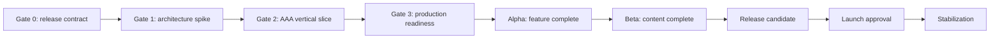

# AAA Release Backlog and Delivery Sequence

## 1. Planning stance

This is a dependency-ordered release backlog, not a calendar promise. Dates and staffing cannot be credible until Gate 0 closes the engine, platform, scale, commercial, art-direction, and content-budget decisions. Production must estimate work from measured architecture and content slices rather than assigning a release date to the current prototype.

Every work package names the release requirements it owns. Closing a work package means its requirements have implementation and verification evidence; completing activities without that evidence does not close it.

## 2. Critical path

The path cannot skip the production vertical slice. The existing native SpriteKit game is valuable product evidence, but it does not retire the renderer, scale, content-pipeline, accessibility, or production-architecture risks required at Gate 2.

## 3. Work package map

| Package | Scope | Requirements | Primary dependency | Completion evidence |
| --- | --- | --- | --- | --- |
| WP-00 Product and decisions | Product promise, business, platform, engine, scale, art, content, localization, online scope | PRD-001 through PRD-006, ART-001, TEC-001 through TEC-003, REL-006 through REL-008 | Executive and discipline ownership | Closed decisions, approved release contract, funded staffing plan |
| WP-01 Simulation foundation | Clock, commands, entities, schedules, deterministic jobs, events, snapshots | SIM-001 through SIM-006, TEC-001 | DEC-001 and DEC-004 | Determinism harness, state hashes, profiling, contract tests |
| WP-02 World and renderer | Terrain, water, networks, streaming, picking, camera, 3D rendering, lighting, weather | BLD-001, BLD-002, ENV-002, ENV-004, UX-003, ART-003 through ART-005, TEC-002, TEC-003 | WP-01 and approved art camera | Golden-region captures and hardware benchmarks |
| WP-03 Construction and development | Planning tools, parcels, zoning, growables, projects, demolition, districts | BLD-003 through BLD-006, ECO-004, ECO-005, UX-004 | WP-01, WP-02, content schemas | District-scale build loop and lifecycle replay |
| WP-04 People and economy | Households, demographics, wellbeing, housing, businesses, jobs, markets, production, finance | ECO-001 through ECO-006, POP-001 through POP-005 | WP-01 and WP-03 | Golden economic cities, conservation, crisis recovery |
| WP-05 Mobility | Trips, routes, roads, parking, transit, freight, service dispatch, diagnostics | MOB-001 through MOB-006 | WP-01 through WP-04 | Congested and transit golden cities within budget |
| WP-06 Utilities, services, governance, and environment | Utility graphs, services, maintenance, policies, incidents, pollution, disaster | GOV-001 through GOV-006, ENV-001 through ENV-003, PRD-004 | WP-01 through WP-05 | Cascade and disaster scenarios with recovery |
| WP-07 Modes, progression, and authored content | Campaign, scenarios, sandbox, objectives, progression, tutorial, regions, content inventory | PRD-002, PRD-003, GOV-005, UX-008, ART-002, REL-008 | Stable systems and content pipeline | Complete campaign and scenario corpus |
| WP-08 Native UX and accessibility | Shell, HUD, tools, inspectors, overlays, charts, notifications, saves, displays, accessibility | PRD-005, UX-001 through UX-010, REL-005 | Snapshot APIs and all player-facing systems | Critical-journey and accessibility qualification |
| WP-09 Art, animation, audio, and identity | Final assets, variation, animation, VFX, music, ambience, UI and action sound | ART-001 through ART-005, AUD-001 through AUD-003 | DEC-003, DEC-007, DEC-008, production renderer | Final content inventory and golden-city review |
| WP-10 Persistence, tools, security, and diagnostics | Save, migration, replay, editors, validators, packages, privacy, telemetry, support export | TEC-004 through TEC-008, UX-007 | WP-01 and DEC-011 through DEC-013 | Save corpus, malformed inputs, tool and support tests |
| WP-11 Qualification and release | CI, golden cities, performance, soak, localization, packaging, notarization, support, legal | REL-001 through REL-010 | All other work packages | Signed RC record and launch sign-offs |

## 4. Gate 0 backlog — release contract

### Product and production

- Approve this specification pack and assign document owners.
- Close DEC-005 and DEC-015 so Release 1 has one commercial and multiplayer boundary.
- Define target audience research, success measures, budget envelope, staffing model, outsourcing posture, and decision authority.
- Convert the content floor into a bottom-up asset and authoring estimate.
- Establish requirement ownership and a risk register tied to decision deadlines.

### Technical and creative discovery

- Prepare the engine and renderer bake-off plan for DEC-001.
- Prepare representative city, camera, and art look targets for DEC-003.
- Define candidate hardware and scale workloads for DEC-002, DEC-004, and DEC-016.
- Preserve the current native vertical slice as a tagged interaction and gameplay reference.

### Exit

Gate 0 exits only when the release boundary, funding authority, decision owners, and Gate 1 spike budget are approved. If these are not approved, the correct next state is preproduction discovery, not full production.

## 5. Gate 1 backlog — production architecture spike

### Runtime spike

- Implement the fixed tick, typed command path, stable entities, random streams, deterministic job phases, state hashes, and immutable presentation snapshot.
- Advance a synthetic city at provisional target scale and report simulation, memory, save, and load budgets.
- Prove versioned snapshot and command-replay persistence with atomic recovery.
- Define platform, simulation, content, rendering, UI, audio, and diagnostics package boundaries.

### Rendering spike

- Render representative terrain, water, a curved network intersection, bridge or tunnel, modular growable block, civic hero, 20,000 moving instances, weather, night lighting, overlay, selection, and construction preview.
- Exercise streaming, LOD, shader prewarming, display scale, window transitions, and graphics-quality changes.
- Measure baseline and target hardware with capture tooling and identify the hard bottleneck.

### Production-pipeline spike

- Compile one region, network kit, modular building family, service asset, vehicle family, citizen set, scenario, objective chain, and localization package from source data.
- Reject deliberate schema, dependency, LOD, material, texture, translation, and budget failures.
- Demonstrate designer iteration without engine recompilation.

### Experience and accessibility spike

- Build native main-window lifecycle, responsive HUD, world picking, camera, one complete construction tool, inspector, overlay, notification, save card, VoiceOver path, large UI, reduced motion, and remapping architecture.

### Exit

Close DEC-001 through DEC-004, DEC-016, and DEC-017. Publish accepted ADRs, benchmark workload, platform matrix, asset budgets, save draft, content schema, and costed Gate 2 plan.

## 6. Gate 2 backlog — AAA vertical slice

The production vertical slice is one 30-to-45-minute authored scenario in a finished region subsection. It must contain:

- Final-quality terrain, water, roads, zoning, growable development, civic service, vehicles, citizens, lighting, weather, animation, effects, music, ambience, and UI.
- A meaningful loop across households, business, jobs, demand, treasury, traffic, one transit mode, power, water, one public service, pollution, policy, objective, incident, and recovery.
- Construction preview, grouped project commitment, demolition consequence, inspector, causal overlay, history chart, notification, tutorial hint, and accessible alternatives.
- Manual save, autosave, load, branch, one migration fixture, support export, benchmark mode, and clean-machine package.
- Target-tier performance plus a documented baseline-tier degradation strategy.

### Exit

Gate 2 exits when external playtesters understand and enjoy the loop, final content can be produced through the pipeline, architecture budgets pass, all high-risk assumptions have measured answers, and the remaining game can be estimated by repeatable production units.

## 7. Gate 3 backlog — production readiness

- Staff durable feature, content, platform, tools, QA, accessibility, localization, security, release, and support ownership.
- Establish protected continuous integration, deterministic fixtures, asset validation, visual capture, hardware lab, save corpus, performance dashboards, and release branches.
- Define source-control strategy for large binary assets and outsourced content intake.
- Complete campaign outline, scenario briefs, region briefs, asset lists, music plan, narrative plan, localization plan, and legal intake.
- Prove parallel content production with at least two region or scenario teams and no manual integration bottleneck.
- Forecast Alpha and Beta from measured throughput with risk ranges rather than point estimates.

### Exit

Every requirement is assigned to a work package and owner; no critical dependency lacks capacity; pipelines support target throughput; and production can add content and systems without repeatedly changing foundational architecture.

## 8. Alpha backlog — feature complete

### Wave A: city foundations

- Finish region, land, network, construction, zoning, district, save, camera, HUD, inspector, and overlay foundations.
- Qualify settlement and growing-town golden cities.

### Wave B: living economy

- Finish household, housing, demographics, wellbeing, business, employment, market, land value, production, freight, ledger, budgets, and debt.
- Qualify economic-transition and financial-crisis golden cities.

### Wave C: connected metropolis

- Finish road operations, transit modes, parking, service dispatch, utilities, public services, maintenance, policy, environment, weather, incidents, disasters, and recovery.
- Qualify congested, transit, utility-cascade, and disaster golden cities.

### Wave D: complete game shell

- Finish campaign and scenario framework, progression, objectives, onboarding, encyclopedia, photo and benchmark modes, settings, remapping, accessibility, localization architecture, diagnostics, and support export.
- All launch modes become playable with representative content.

### Alpha exit

Every release requirement has a production implementation path and passes at least its functional acceptance. No placeholder hides a missing system loop, persistence path, input path, or accessibility architecture. Remaining work is content completion, balance, optimization, defect repair, and polish.

## 9. Beta backlog — content complete

- Integrate and lock every launch region, campaign city, standalone scenario, asset, animation, effect, track, ambience set, voice line, tutorial, encyclopedia entry, achievement, icon, name pool, and language.
- Complete balance passes for all supported strategies and difficulty settings.
- Finish art repetition, lighting, weather, audio fatigue, narrative sensitivity, accessibility, localization, culturalization, and marketing-truth reviews.
- Migrate the complete historical save corpus and freeze compatibility policy.
- Reach continuous performance, stability, and golden-replay gates on the full content set.
- Remove debug assets, placeholder strings, prototype dependencies, cheat defaults, and unlicensed content from release packages.

### Beta exit

Only stop-ship fixes, measured optimization, and specifically approved polish remain. New features or content require an executive scope exception and full impact review.

## 10. Release candidate backlog

- Freeze source, content, dependencies, schemas, saves, localization, legal notices, privacy, store metadata, support content, and build infrastructure.
- Produce the immutable signed candidate from the protected pipeline.
- Complete 100 consecutive golden runs, hardware qualification, 24-hour soak, 100-logical-hour city advancement, full save corpus, clean installation, update, rollback, offline, accessibility, localization, security, and support rehearsal.
- Triage every crash cluster and open Priority 2 issue; close all Priority 0 and Priority 1 issues.
- Capture requirement matrix, waivers, benchmarks, test reports, conformance, approvals, checksums, symbols, manifests, bill of materials, and notarization evidence.

### Release candidate exit

The exact candidate artifact and release record receive all sign-offs named in the quality specification. Rebuilding after sign-off creates a new candidate and reruns the affected gates.

## 11. Launch and stabilization backlog

- Stage packages, store pages, update manifests, status communication, known issues, support rotation, crash triage, save-recovery escalation, hotfix pipeline, and rollback artifact.
- Monitor launch health without making optional telemetry a condition of play.
- Publish accurate known issues and workarounds.
- Prioritize save loss, launch failure, crashes, progression blockers, severe performance, and accessibility regressions in that order of player harm.
- Keep hotfixes compatible with launch saves and test them against the full affected corpus.
- Complete the stabilization retrospective and convert unresolved risks into owned maintenance work before expansion production.

## 12. Definition of ready

A backlog item enters implementation only when it has:

- Requirement IDs and an approved design source.
- Player outcome and measurable acceptance.
- Named product, design, implementation, verification, and content owners as applicable.
- Dependencies, data contracts, save effect, accessibility effect, localization effect, performance budget, and failure behavior.
- Required assets, tools, test fixtures, hardware, and external inputs available or explicitly scheduled.
- A scope small enough to reach an integrated playable state within one production iteration.

## 13. Definition of done

A backlog item is done only when:

- Complete behavior is integrated in the production build.
- Unit, contract, integration, replay, visual, performance, accessibility, localization, and manual evidence appropriate to the item pass.
- Save and migration impact is implemented and tested.
- Telemetry or diagnostics are privacy-reviewed and useful.
- Content and tools have actionable validation.
- Documentation, help, support, and requirement links are updated.
- No known defect invalidates the acceptance statement.
- The traceability row is truthfully advanced to `Mapped`.

## 14. Estimation and reporting

After Gate 2, production estimates repeatable units such as region kit, growable family, service asset, network family, vehicle family, citizen set, scenario hour, music minute, localized word, simulation system, management workspace, golden fixture, and migration step.

Reports track requirement burn-up, accepted content units, defect arrival and escape, performance headroom, save-corpus pass rate, accessibility critical paths, localization completion, decision age, risk exposure, and milestone confidence range. Lines of code, raw asset count, and task closure are supporting metrics, not measures of release completeness.

