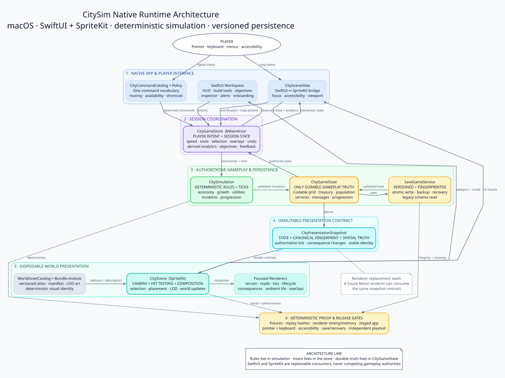

# CitySim Native Runtime Architecture

This diagram describes the active native macOS product under
`Native/CitySimNative`. It intentionally does not describe the legacy Python
implementation or present the future Metal renderer as current behavior.

## Architectural invariants

1. `CityGameState` is the only durable gameplay authority.
2. `CitySimulation` owns deterministic rules and state transitions.
3. `CityGameStore` owns player intent and session-level interaction state.
4. SwiftUI and SpriteKit consume state; they do not create competing gameplay
   truth.
5. `CityPresentationSnapshot` is the immutable boundary that lets rendering
   evolve without rewriting simulation or persistence.
6. Saves are versioned and fingerprinted, use atomic replacement, and retain a
   recovery path.

## Sendable files

- `diagrams/citysim-native-runtime-architecture.svg` — scalable source for
  documents, presentations, and websites.
- `diagrams/citysim-native-runtime-architecture.png` — high-resolution image
  for email and chat.
- `diagrams/citysim-native-runtime-architecture.dot` — editable diagram source.
