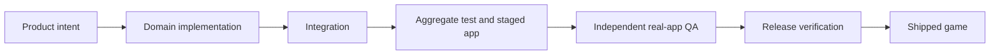

# CitySim Agent Company

Start at [[Agent 001 - CEO]]. In Obsidian, filter the graph to path:"docs/production/company/agents".

Every non-CEO agent has exactly one reporting manager. Manager notes link only to their direct reports, so the graph forms the operating hierarchy instead of a flat directory.

## Delivery system

## Company rules

- One accountable owner per deliverable; specialists may collaborate but never share final ownership.
- Product agents build and prove focused work. The Integration Captain alone composes master.
- Independent QA never repairs product bytes and cannot convert an unobserved result into a pass.
- Release agents package only an accepted immutable candidate and cannot waive a failed gate.
- Every failure returns the exact blocker, current owner, and smallest lawful recovery.
- A role note defines a durable company position. A Codex task or worktree is a temporary execution instance of that role.

## Definition of shipped

The company is done only when the exact candidate has passed focused proof, aggregate tests, staged-build verification, independent real-app journeys including save/relaunch, release verification, and origin parity.
